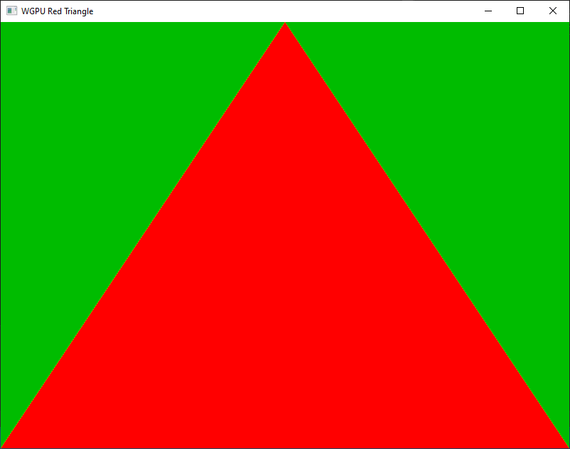

# Odin WGPU Examples

All examples uses the wrapper package.

## Examples

Execute the `odin build` command inside the `examples` folder.

### [Info](./info/info.odin)

Print current WGPU version and selected adapter information.

```shell
odin build ./info -out:./build/<executable-name>
```

Output example:

```shell
WGPU version: 0.17.0.2

Selected device:

NVIDIA GeForce RTX 3060
        Driver: 536.99
        Type: Discrete GPU with separate CPU/GPU memory
        Backend: Vulkan API
```

### [Simple Compute](./simple_compute/simple_compute.odin)

```shell
odin build ./simple_compute -out:./build/<executable-name>
```

### [Triangle](./triangle/triangle.odin)

This example uses `SDL2` from the `vendor:sdl2` package on all platforms.

```shell
odin build ./triangle -out:./build/<executable-name>
```

#### Triangle MSAA

This uses the same triangle example but with 4x MSAA.

```shell
odin build ./triangle -define:TRIANGLE_MSAA_EXAMPLE=true -out:./build/<executable-name>
```

#### Screenshots



### [Capture](./capture/capture.odin)

This example shows how to capture an image by rendering it to a texture, copying the texture to a buffer, and retrieving it from the buffer.

This create ./red.png with all pixels red and size 100x200.

```shell
odin build ./capture -out:./build/<executable-name>
```

**Note**: If you get `write_png` reference errors, try to run the Makefile on `/vendor/stb/src`.

#### Screenshots


### [Learn WGPU Tutorial](./learn_wgpu)

This is a great Rust tutorial you can read from [Learn Wgpu](https://sotrh.github.io/learn-wgpu/#what-is-wgpu). The challenges are included.
