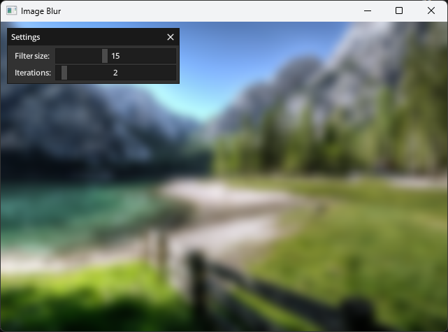

# Image Blur Example

This example demonstrates how to use the compute shader to blur a input texture.

## Build

To build the example, use the following command:

```shell
odin build ./image_blur -out:./build/<executable-name>
```

Replace `<executable-name>` with your desired output name.

## Screenshots


