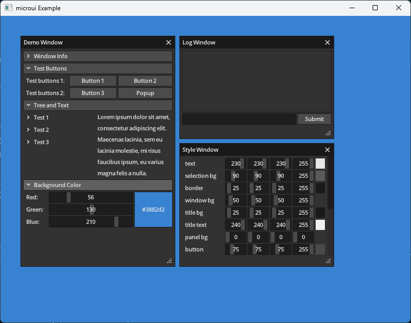

# MicroUI Example

This example demonstrates how to use MicroUI with a WGPU-based renderer in Odin.

## Build

To build the example, use the following command:

```shell
odin build ./microui -out:./build/<executable-name>
```

Replace `<executable-name>` with your desired output name.

## Usage

The renderer utilities used in this example can be imported from the `utils/microui` folder. Here's a basic usage example:

```odin
import mu "vendor:microui"
import wmu "wgpu/utils/microui"

// Initialize WGPU device, queue, and surface configuration
// ...

// Initialize the renderer
wmu.init(&device, &queue, &surface_config)
mu.init(mu_ctx)

// In your render loop:
mu.begin(mu_ctx)
// ... populate your MicroUI context ...
mu.end(mu_ctx)

// Render the UI
wmu.render(&mu_ctx, &render_pass)

// When resizing:
wmu.resize(new_width, new_height)

// Cleanup
wmu.destroy()
```

## Screenshots


