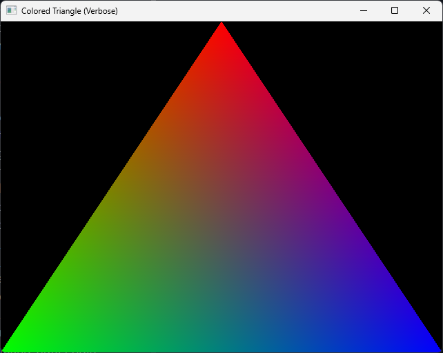

# Triangle

This example renders a triangle to a window.

## Build

```shell
odin build ./triangle -out:./build/<executable-name>
```

Using the build script:

```shell
.\build_win.bat triangle
```

```shell
make triangle
```

## Screenshots


